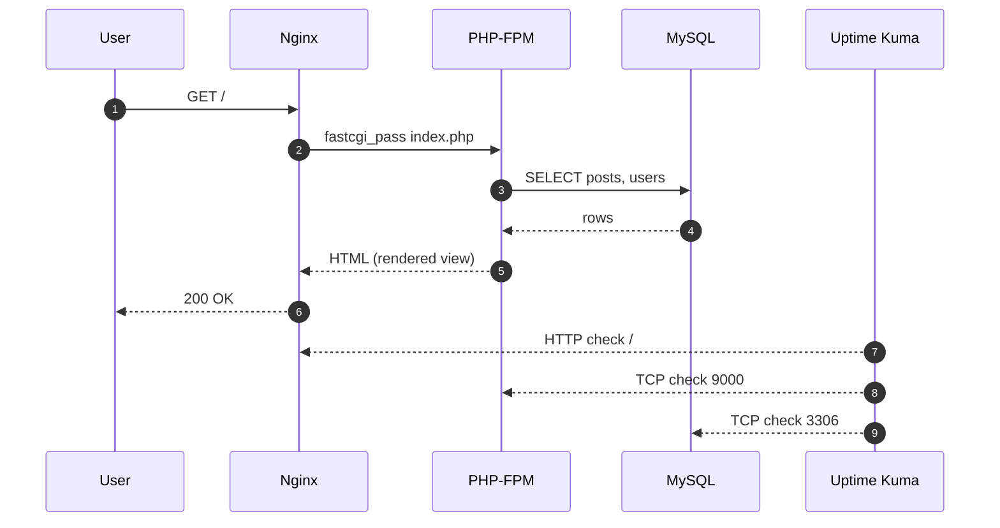
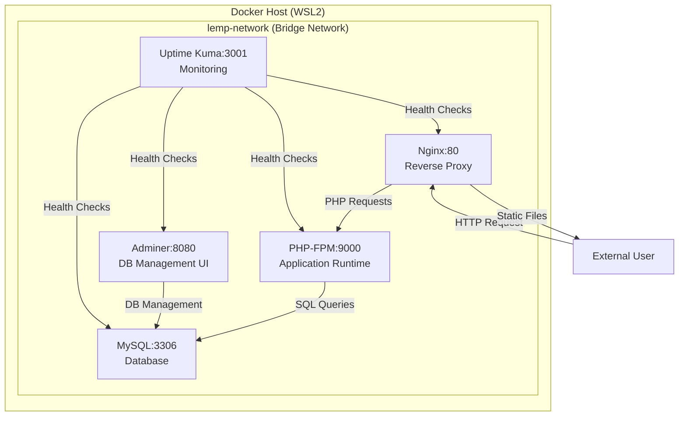
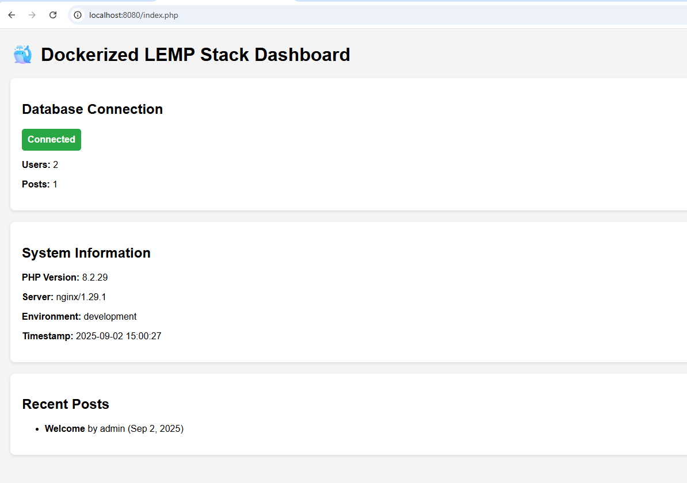
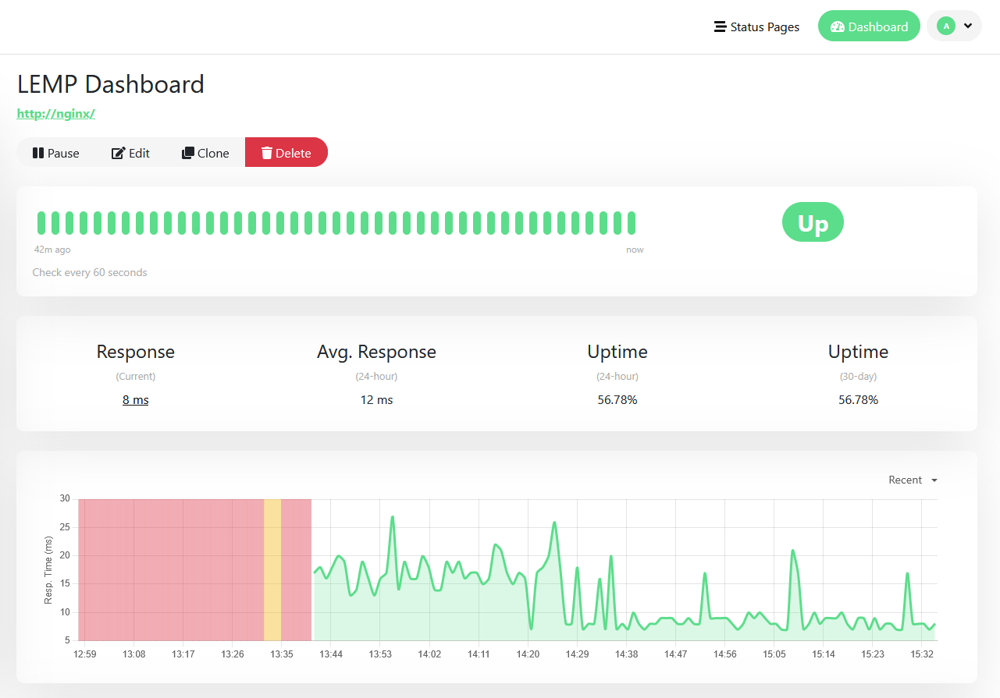
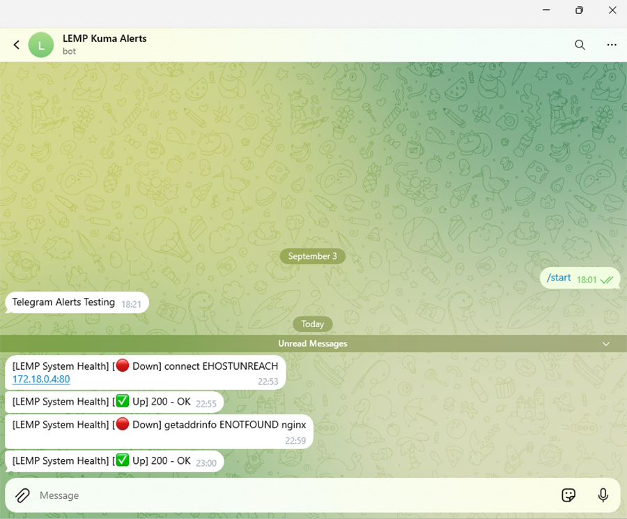

# Dockerized LEMP stack with integrated monitoring

A production-aligned **LEMP stack** packaged for local or staging environments.  
Includes containerized **Nginx**, **PHP-FPM**, **MySQL**, **Adminer**, and **Uptime Kuma** with automated health checks.  
Built for reproducible local or staging environments with integrated observability.

<p align="center">
  
</p>

[](./LICENSE)
[](https://github.com/Soumalya-De/LEMP-Sentinel/actions)
[](https://www.docker.com/)
[](https://github.com/louislam/uptime-kuma)
[](http://makeapullrequest.com)
[](https://github.com/Soumalya-De/LEMP-Sentinel/stargazers)
[](https://github.com/Soumalya-De/LEMP-Sentinel/network/members)
[](https://github.com/Soumalya-De/LEMP-Sentinel/commits/main)
[](https://github.com/Soumalya-De/LEMP-Sentinel/actions/workflows/security-scan-fixed.yml)

---

## Executive Summary


This repository delivers a production-aligned LEMP stack wired for observability, security, and safe local defaults.

- What: Dockerized Nginx + PHP-FPM + MySQL with Adminer and Uptime Kuma, health-checked and ready in minutes.
- Why: Reproducible environments, secrets hygiene via .env, and first-class monitoring to surface failures quickly.
- Who: Learners, candidates, and teams needing a clean reference that demonstrates DevOps/SRE thinking.
- How: Docker Compose v2, internal networking, gated startup via healthchecks, and dev-only diagnostics.
- Success criteria: stack starts; `/test-db.php` passes; Adminer login works; Kuma shows green; no secrets in git.
- Out-of-scope: public TLS/WAF (see Future updates for next steps).
- New: Manual database backup/restore workflow for disaster recovery and migration validation.

Quick links:
- Quickstart: jump to [Quickstart](#quickstart)
- Dashboard: http://localhost:8080
- Adminer (dev profile only): http://localhost:8081
- Uptime Kuma: http://localhost:3001

---

## Repository Layout
```
LEMP-Sentinel/
├── docker-compose.yml              # Service orchestration
├── docker-compose.nonroot.yml      # Optional override to run PHP as non-root
├── docker-compose.prod.yml         # Production overrides with pinned digest images
├── .env.example                    # Template for environment variables
├── .env                            # Local secrets (never commit, ignored by git)
├── .gitignore                      # Prevents secret leakage
├── .trivyignore                    # Temporary CVE suppressions with rationale
├── .pre-commit-config.yaml         # Local hooks: gitleaks + detect-secrets
├── .secrets.baseline               # Baseline for detect-secrets (safe to commit)
├── Makefile                        # Common dev tasks (build/up/down/logs/lint/smoke/bcrypt)
├── CONTRIBUTING.md                 # Contributor guidelines
├── SECURITY.md                     # Security policy and vulnerability reporting
├── LICENSE                         # MIT License for code
├── LICENSE-DOCS                    # CC BY 4.0 License for documentation
├── README.md                       # This documentation
├── .github/
│   ├── workflows/
│   │   ├── ci.yml                  # Main CI: secrets scan + build + smoke tests
│   │   ├── security-scan-fixed.yml # Nightly Trivy security scans with SARIF upload
│   │   ├── nightly-trivy-scan.yml  # Alternate nightly scanner with issue creation
│   │   ├── build-and-pin-php-patched.yml  # Build patched PHP base images
│   │   └── db-backup-restore.yml   # Manual database backup/restore workflow
│   ├── dependabot.yml              # Automated dependency updates for Docker & Actions
│   ├── pull_request_template.md    # PR template with checklist
│   └── ISSUE_TEMPLATE/
│       ├── bug_report.md           # Bug report template
│       ├── feature_request.md      # Feature request template
│       ├── security_vulnerability.md  # Security report template
│       └── config.yml              # Issue template configuration
├── .vscode/
│   └── settings.json               # Disable auto port forwarding; ignore 3306/9000
├── scripts/
│   └── bcrypt.php                  # BCrypt password hashing helper utility
├── nginx/
│   ├── Dockerfile                  # Custom Nginx image with curl for healthchecks
│   └── default.conf                # Nginx server & routing rules
├── php/
│   ├── Dockerfile                  # Custom PHP-FPM image with extensions
│   └── php.ini                     # PHP runtime & security settings
├── mysql/
│   └── init.sql                    # Database schema and seed data
├── www/                            # Application code
│   ├── index.php                   # Main dashboard
│   ├── info.php                    # Restricted PHP info page
│   └── test-db.php                 # JSON API for DB tests
├── docs/                           # Documentation
│   ├── secrets.md                  # Secrets management guide
│   └── security-hardening.md       # Security best practices
└── images/                         # Screenshots for documentation
    └── LEMP-GitHub-Cover-Banner.png
```

### Complete file reference
This section lists every file/folder and its purpose for easy navigation.

- **Root files**
  - `docker-compose.yml` — Orchestrates Nginx, PHP-FPM, MySQL, Adminer, Uptime Kuma, networks and volumes
  - `docker-compose.nonroot.yml` — Optional override to run PHP container as the host user (avoids file permission issues)
  - `docker-compose.prod.yml` — Production overrides with digest-pinned base images for supply-chain security
  - `Makefile` — Shortcuts for build/up/down/logs/lint/smoke/reset/bcrypt
  - `README.md` — This documentation
  - `.gitignore` — Ensures secrets like `.env` and local artifacts are never committed
  - `.env.example` — Safe template for environment variables to copy into `.env`
  - `.env` — Local secrets file (never commit, ignored by git)
  - `.trivyignore` — Temporary CVE suppressions with rationale and tracking info (remove after base image fixes)
  - `.pre-commit-config.yaml` — Pre-commit hooks (gitleaks, detect-secrets)
  - `.secrets.baseline` — Baseline for `detect-secrets` detector
  - `CONTRIBUTING.md` — Contributor guidelines and development workflow
  - `SECURITY.md` — Security policy and vulnerability reporting instructions
  - `LICENSE` — MIT License for code
  - `LICENSE-DOCS` — CC BY 4.0 License for documentation

- **CI & Automation (`.github/`)**
  - `workflows/ci.yml` — Main CI pipeline: secret scan (gitleaks), compose config validation, PHP lint, build, smoke tests, SBOM generation, Trivy image scans
  - `workflows/security-scan-fixed.yml` — Nightly security scanner that runs Trivy on all images and uploads SARIF results to GitHub Security tab
  - `workflows/nightly-trivy-scan.yml` — Alternative nightly scanner with automated GitHub issue creation for CRITICAL vulnerabilities
  - `workflows/build-and-pin-php-patched.yml` — Workflow to build patched PHP base images with updated libxml2/other dependencies and pin digests
  - `workflows/db-backup-restore.yml` — Manual workflow for database backup/restore testing and validation
  - `dependabot.yml` — Automated dependency updates for Docker base images and GitHub Actions versions
  - `pull_request_template.md` — Pull request template with checklist for contributors
  - `ISSUE_TEMPLATE/bug_report.md` — Bug report issue template
  - `ISSUE_TEMPLATE/feature_request.md` — Feature request issue template
  - `ISSUE_TEMPLATE/security_vulnerability.md` — Security vulnerability report template
  - `ISSUE_TEMPLATE/config.yml` — Issue template configuration

- **Scripts**
  - `scripts/bcrypt.php` — Standalone PHP script for generating BCrypt password hashes (use via `make bcrypt`)

- **Editor Configuration**
  - `.vscode/settings.json` — Disables VS Code auto port-forward and ignores internal ports (3306, 9000)

- **Nginx**
  - `nginx/Dockerfile` — Nginx image (alpine) with curl installed for healthchecks
  - `nginx/default.conf` — Virtual host, PHP-FPM upstream, and static file rules

- **PHP**
  - `php/Dockerfile` — PHP-FPM (8.2) with common extensions and composer
  - `php/php.ini` — Runtime limits, error handling, security, and opcache settings

- **MySQL**
  - `mysql/init.sql` — Creates `users` and `posts` tables and seeds sample rows

- **Web Application**
  - `www/index.php` — Dashboard UI; shows DB connection and recent posts
  - `www/test-db.php` — Dev-only API that performs connection, schema, read, write, delete tests
  - `www/info.php` — Dev-only phpinfo page gated by `APP_ENV=development`

- **Documentation & Assets**
  - `docs/secrets.md` — Comprehensive guide for secrets management and .env configuration
  - `docs/security-hardening.md` — Security best practices and hardening recommendations
  - `images/LEMP-GitHub-Cover-Banner.png` — Cover image used in README

**Notes:**
- A `.env` file holds secrets for local use only and is ignored by git. Share `.env.example` instead.
- Internal service ports (PHP:9000, MySQL:3306) are not exposed to the host; Nginx/Adminer/Kuma are.

---

## Screenshots and Diagrams
This section collects key visuals that complement the documentation.

- System Architecture — see the diagram in the [Architecture](#architecture) section.

Additional screenshots (e.g., Dashboard, Adminer) can be added here as they become available. Images below use fixed widths for consistent layout.

---

## Final Report
If you have a finalized report, you can include the PDF at `docs/REPORT.pdf` for sharing. This repository does not maintain a Markdown version of the report.

---

## Table of Contents
- [Executive Summary](#executive-summary)
- [Repository Layout](#repository-layout)
- [Screenshots and Diagrams](#screenshots-and-diagrams)
- [Final Report](#final-report)
- [Demo](#demo)
- [Features](#features)
- [Why This Project](#why-this-project)
- [Competency Mapping](#competency-mapping)
- [Design Decisions](#design-decisions)
- [Architecture](#architecture)
- [Quickstart](#quickstart)
  - [Local (WSL2 + Docker Desktop)](#local-wsl2--docker-desktop)
  - [Windows (WSL2) quick start](#windows-wsl2-quick-start)
  - [macOS quick start](#macos-quick-start)
- [Configuration](#configuration)
- [Continuous Integration (CI)](#continuous-integration-ci)
- [Pre-commit Hooks (Local)](#pre-commit-hooks-local)
- [VS Code: Avoid Random Ports (Optional)](#vs-code-avoid-random-ports-optional)
- [Usage](#usage)
- [Testing](#testing)
- [Evaluation Checklist](#evaluation-checklist)
- [Observability and Monitoring](#observability-and-monitoring)
- [Security Notes](#security-notes)
- [DevOps Notes](#devops-notes)
- [System Requirements](#system-requirements)
- [Troubleshooting](#troubleshooting)
- [Clean Reset](#clean-reset)
- [Performance](#performance)
- [Operational Playbooks (First Response)](#operational-playbooks-first-response)
- [Contributing](#contributing)
- [Future Updates](#future-updates)
- [License](#license)
 - [Security Policy](#security)
 - [Secrets Management Guide](docs/secrets.md)

---

## Demo
**Live Dashboard:** `http://localhost:8080`  
**Database UI (Adminer):** `http://localhost:8081` (only when `--profile dev` is enabled)  
**Monitoring (Uptime Kuma):** `http://localhost:3001`


---

## Features
| Feature | Description |
|--------|-------------|
| **One-Command Setup** | `docker compose up --build` deploys entire stack in <2 mins on any modern laptop. |
| **Environment Consistency** | Eliminates "works on my machine" using Docker + WSL2. Identical dev/staging/prod environments. |
| **Secure Secrets Management** | All credentials stored in `.env` files — never committed. `.env.example` template included. |
| **Automated Health Checks** | Nginx, PHP-FPM, MySQL, Adminer, and even Uptime Kuma itself are monitored via Docker healthchecks. |
| **Real-Time Observability** | Uptime Kuma tracks all services with 60s heartbeat intervals and historical uptime graphs. |
| **Proactive Alerts** | Optional: configure alerts in the Uptime Kuma UI (Telegram/Discord/etc.) — not committed.
| **Lightweight & Portable** | Uses Alpine base images, no heavy VMs. Runs on Windows (WSL2), macOS, Linux. |
| **Low friction** | Minimal setup and consistent behavior across environments. |
| **GitOps Ready** | Clean repo structure, `.gitignore` hardened, CI/CD pipeline ready for future integration. |

---

## Why This Project
This project provides a clean, containerized LEMP reference with monitoring and health checks for reliable local or staging use.

### Traditional LEMP Repo vs This Project
| Traditional LEMP Repo | This Project |
|-----------------------|--------------|
| Manual setup, inconsistent environments | Reproducible via `docker compose up` |
| Secrets in code | `.env` + `.gitignore` enforced |
| "It's running" = success | Health checks + uptime tracking |
| No alerts | Optional alerts via Uptime Kuma (configured in UI) |
| No observability | Uptime Kuma dashboard with metrics |
| Not testable | `test-db.php` integration endpoint |
| No documentation | This README with setup, CI, and ops docs |

- **Solves "It Works on My Machine":** Eliminates environment inconsistency through containerization, ensuring identical behavior from localhost to production.
- **Bridges the Learning Gap:** Connects academic concepts with industry-standard DevOps/SRE practices: IaC, monitoring, and secure secret management.
- **Cost-Efficient for Startups:** Provides a robust local development environment with monitoring, eliminating costly cloud-based dev environments (~$30-70/developer/month).
- **Designed for Resilience:** Health checks and dependency-aware startup order prevent runtime errors due to unready services, mimicking production Kubernetes readiness probes.

> [!NOTE]
> Key takeaway: reproducible environments + built-in visibility + safe defaults for local/staging.

#### Motivation
- Build a one-command, OS-agnostic LEMP stack that mirrors real operations (health checks, monitoring, alerts).
- Keep secrets out of git using `.env` and scanners; make issues observable via Uptime Kuma and Telegram.
- Define success as more than “it runs”: all services healthy, integration test passes, Kuma shows green, alerts fire on down/up.
- Outcome: a production-aligned local/staging reference that demonstrates practical DevOps/SRE habits.

---

## Competency Mapping

This project showcases practical skills across the stack:

- Docker & Compose: multi-service orchestration, networks, volumes, healthchecks, dependency ordering.
- Nginx: reverse proxying to PHP-FPM, clean URL routing, and production-ready caching/compression snippets.
- PHP-FPM: extensions (PDO/MySQL, gd, intl, mbstring), OPcache tuning, env-driven behavior, dev gating.
- MySQL: first-run initialization via `init.sql`, seed data, and Adminer-based inspection.
- Observability: Uptime Kuma monitors for HTTP/TCP, heartbeat intervals, and alert integrations.
- Secrets hygiene: `.env` ignored by git, `.env.example` template, pre-commit and CI scanning (gitleaks/detect-secrets).
- CI fundamentals: Compose validation, PHP lint, build-and-smoke tests against critical endpoints.
- Editor/OS hygiene: VS Code port-forward controls to avoid noisy/random forwards.
- Networking & security posture: internal-only PHP/MySQL, minimal host ports, dev-only diagnostics gated by `APP_ENV`.
- SRE operations: runbooks/playbooks for first response and targeted service checks.

---

## Design Decisions

- Internal-only critical ports: PHP-FPM (9000) and MySQL (3306) stay on the bridge network; only Nginx/Adminer/Kuma are exposed to host.
- Health-checked startup: services declare healthchecks; dependents wait until upstreams are healthy to reduce flakiness.
- Dev diagnostics, not production features: `info.php` and `test-db.php` exist only when `APP_ENV=development`.
- Adminer included for local DB introspection: explicitly not for production; remove before deployment.
- Uptime Kuma for visibility: simple, UI-configured monitors and optional alerts; avoids committing alert secrets.
- OPcache enabled by default: sensible defaults in `php.ini`; production can disable timestamp validation for max performance.
- PHP-FPM listens on 0.0.0.0:9000 inside the container: reachable only on the internal network.
- Optional non-root override for PHP: prevents host file permission issues on bind mounts without complicating the default path.
- Image pinning via env: `NGINX_BASE_IMAGE` and `PHP_BASE_IMAGE` allow digest pinning in `.env` for reproducibility.
- Editor ergonomics: `.vscode/settings.json` disables auto port-forward and ignores internal ports to prevent noisy prompts.
- Data persistence: named volumes for MySQL and Kuma; `make reset` wipes volumes for a clean slate.

Trade-offs: TLS/ACME automation, backups, and advanced observability (metrics/tracing) are intentionally out-of-scope for brevity.

---

## Architecture

The system is a multi-container application orchestrated by Docker Compose. All services run on a custom `lemp-network` bridge for isolated inter-container communication.

<p align="center">
  
</p>

> [!NOTE]
> Key takeaway: single ingress (Nginx), internal-only PHP/MySQL, and health-checked startup on an isolated bridge network.

### Request and Data Flow
This diagram illustrates how a request travels across Nginx → PHP-FPM → MySQL and how Uptime Kuma observes each hop.

<p align="center">
  
</p>

#### Lifecycle (happy path)
- Client sends HTTP request → Nginx accepts on port 80 (host: 8080).
- Nginx forwards PHP requests to PHP-FPM over fastCGI (internal port 9000).
- PHP application reads env vars (`DB_HOST`, `DB_NAME`, `DB_USER`, `DB_PASSWORD`).
- Application performs SQL via PDO/MySQL to the database (internal port 3306).
- Results are rendered by PHP and returned through Nginx to the client.

#### Monitoring overlay
- Uptime Kuma probes:
  - HTTP: Nginx (`/`), test API (`/test-db.php`)
  - TCP: PHP-FPM (9000), MySQL (3306)
- Healthchecks in `docker-compose.yml` gate startup order and mark containers healthy.

#### Failure modes to consider
- MySQL unavailable → PHP errors on connection; Nginx still 200 for static assets.
- PHP-FPM down → Nginx returns 502 Bad Gateway for dynamic routes.
- Nginx misconfig → endpoints unreachable; Kuma alarms via HTTP 4xx/5xx.
- Env mismatch → Access denied (1045) until credentials/volume are corrected.

#### Security notes
- Only Nginx (8080), Adminer (8081), Uptime Kuma (3001) are exposed to host.
- MySQL and PHP-FPM remain internal on `lemp-network`.
- Dev-only diagnostics (`info.php`, `test-db.php`) are gated by `APP_ENV=development`.

#### Sequence (concise)


---

### Nginx Configuration
File: `nginx/default.conf`

- Serves PHP via `php:9000` (PHP-FPM container).  
- Uses `try_files` to route clean URLs to `index.php`.  
- Blocks hidden files (e.g. `.ht*`).  
- Suitable for local development. For production add HTTPS (Certbot/Let’s Encrypt), caching, rate limiting, and stricter headers.


---

### Nginx Dockerfile
File: `nginx/Dockerfile`

- Extends the lightweight `nginx:alpine` base image.  
- Installs `curl` to support container health checks.  
- No other modifications are made, keeping the image minimal.

---

### PHP-FPM Dockerfile
File: `php/Dockerfile`

- Based on `php:8.2-fpm-alpine` for a lightweight runtime.  
- Installs build tools and common PHP extensions:
  - `gd` (image processing with JPEG/PNG support)  
  - `pdo`, `pdo_mysql`, `mysqli` (database connectivity)  
  - `zip`, `intl`, `mbstring`, `bcmath`, `opcache` (performance & i18n)  
- Installs Composer globally for dependency management.  
- Configures PHP-FPM to listen on all interfaces (`0.0.0.0:9000`).  
- Copies a custom `php.ini` into the container.  
- Adds a health check (`pidof php-fpm`) for container monitoring.  
- Exposes port `9000`.


### PHP Configuration
File: `php/php.ini`

Key settings:
- **Performance limits**: `memory_limit=256M`, `max_execution_time=300s`, `upload_max_filesize=50M`.  
- **Error handling**: `display_errors=Off` (production safe), `log_errors=On`.  
- **Timezone**: configurable via `PHP_TIMEZONE` env variable, defaults to `Asia/Kolkata`.  
- **Security**:
  - `expose_php=Off` (hides PHP version from headers)  
  - `allow_url_fopen=Off`, `allow_url_include=Off` (blocks remote file inclusion)  
  - Secure session cookies (`httponly`, `samesite=Lax`, `secure=1`)  
- **OPcache**: enabled with 128 MB memory for faster PHP execution.  

These defaults are production-aware but lightweight for local development.

---

### MySQL Initialization
File: `mysql/init.sql`

- Creates two tables:  
  - `users`: id, username, email, password hash, created_at  
  - `posts`: id, user_id (FK), title, content, status, created_at  
- Seeds demo data:
  - Users: `admin`, `john_doe` (with placeholder `hashedpassword`)  
  - One sample post linked to `admin`  

⚠️ Note: `password_hash` values are placeholders for demo only. Replace with real bcrypt hashes.  

Generate a bcrypt hash using the built-in helper:
```bash
# Option A: via Makefile
make bcrypt PASSWORD='your-secure-password'

# Option B: directly with PHP CLI inside a container
docker run --rm -v "$PWD/scripts":/scripts php:8.2-cli php /scripts/bcrypt.php 'your-secure-password'
```

Then update `mysql/init.sql` seed users, for example:
```sql
INSERT INTO users (username, email, password_hash) VALUES
('admin', 'admin@example.com', '$2y$10$REPLACE_WITH_REAL_BCRYPT_HASH'),
('john_doe', 'john@example.com', '$2y$10$REPLACE_WITH_REAL_BCRYPT_HASH');
```

---

### Adminer
- A lightweight database management UI (web-based).  
- Runs on `http://localhost:8081`.  
- Useful for quickly inspecting or editing MySQL tables during development.  

> [!WARNING]
> Adminer is for local development only. It is now placed under the `dev` profile and excluded by default.

Usage:
```bash
# Default: prod-like (no Adminer)
docker compose up -d

# Dev: include Adminer explicitly
docker compose --profile dev up -d
```

---

### Uptime Kuma
- Monitors all critical services (Nginx, PHP-FPM, MySQL, Adminer, Kuma itself).  
- Provides uptime graphs, response time metrics, and history.  
- Runs on `http://localhost:3001`.  
- Supports Telegram and Discord alerts for downtime.  

---

### System Overview

### Technology Stack
| Service | Version | Purpose | Port (Host) |
| :--- | :--- | :--- | :--- |
| **Nginx** | `alpine` | Web Server & Reverse Proxy | 8080 (host) |
| **PHP-FPM** | `8.2-fpm-alpine` | Application Runtime (Custom Build) | internal (9000) |
| **MySQL** | `8.0` | Relational Database | internal (3306) |
| **Adminer** | `latest` | Database Management UI | 8081 (host) |
| **Uptime Kuma** | `1` | Monitoring & Alerting | 3001 (host) |

---

## Quickstart
### Local (WSL2 + Docker Desktop)


#### Prerequisites
- Windows 11 (Home/Pro) **or** macOS/Linux
- WSL2 + Ubuntu 22.04 (Windows only)
- Docker Desktop with WSL2 backend enabled
- VS Code + Remote-WSL extension (optional but recommended)

#### Steps
```bash
# 1. Clone the repo
git clone https://github.com/Soumalya-De/LEMP-Sentinel.git
cd LEMP-Sentinel
# 2. Copy environment template
cp .env.example .env
# 3. Build & start (one command)
docker compose up --build -d
# 4. Wait 30s — then verify
docker ps --format "table {{.Names}}\t{{.Status}}"
# 5. Access services:
#   Dashboard: http://localhost:8080
#   Adminer:   http://localhost:8081   (only with --profile dev)
#   Uptime Kuma: http://localhost:3001
```

### With Makefile (optional)
```bash
make build      # docker compose build
make up         # docker compose up -d
make up-nonroot # run PHP as your host user (see below)
make ps         # show containers
make logs       # tail logs
make lint-php   # php -l on all files in /www
make smoke      # curl checks for /, /test-db.php, /info.php
make reset      # down + remove volumes + orphans
make db-backup  # dump DB to backups/my_app_db.sql
make db-restore # restore DB from backups/my_app_db.sql
```

#### Restarting Later
```bash
cd ~/LEMP-Sentinel
docker compose up -d  # No rebuild needed!
```

### Windows (WSL2) quick start

Use this if you're on Windows 10/11 and plan to work inside Ubuntu (WSL2).

1) Install Ubuntu 24.04 (PowerShell as Administrator)
```powershell
wsl --install -d Ubuntu-24.04
wsl --set-default-version 2
wsl --set-default Ubuntu-24.04
```

2) Open Ubuntu (WSL) and install Docker
- Recommended: Docker Desktop for Windows with "Use the WSL 2 based engine" enabled.
- Alternative: Install the engine inside WSL:
```bash
sudo apt-get update
sudo apt-get install -y docker.io docker-compose-plugin
sudo usermod -aG docker $USER
newgrp docker # or log out/in of WSL
```

3) Clone and run inside WSL
```bash
git clone https://github.com/Soumalya-De/LEMP-Sentinel.git
cd LEMP-Sentinel
cp .env.example .env
docker compose up --build -d
```

4) Verify
```bash
docker compose ps
xdg-open http://localhost:8080 || true
```

Notes
- Store the repo under the Linux home directory (e.g., `~/LEMP-Sentinel`) for best file I/O performance.
- VS Code users: install "Remote - WSL" and open the folder in WSL for a smoother experience.

---

### macOS quick start

Two options: Docker Desktop (GUI) or Colima (lightweight, Homebrew-based). Both work well.

1) Install Docker
- **Docker Desktop**: download from docker.com and install.
- **Colima + Docker CLI** (Homebrew):
  ```bash
  brew install colima docker docker-compose
  colima start --cpu 2 --memory 4 --vm-type=qemu
  docker context use default
  ```

2) Clone and run
```bash
git clone https://github.com/Soumalya-De/LEMP-Sentinel.git
cd LEMP-Sentinel
cp .env.example .env
docker compose up --build -d
```

3) Verify & open services
```bash
docker compose ps
open http://localhost:8080
open http://localhost:8081  # if running with --profile dev
open http://localhost:3001
```

**Notes:**
- On Apple Silicon (M1/M2/M3), images are multi-arch; Docker will pull the `arm64` variants automatically.
- If switching between Docker Desktop and Colima, stop one before starting the other to avoid socket conflicts.

---

## Configuration
All configuration is externalized via `.env`.

### `.env.example` (safe to commit)
```
# Database configuration
DB_HOST=mysql
DB_NAME=my_database
DB_USER=my_app_user
DB_PASSWORD=SECURE_PASSWORD_HERE
MYSQL_ROOT_PASSWORD=SECURE_ROOT_PASSWORD_HERE

# Application
APP_ENV=development
APP_DEBUG=true
APP_URL=http://localhost:8080

# Container user (optional for PHP non-root)
APP_USER_ID=1000
APP_GROUP_ID=1000

# Uptime Kuma
UPTIME_KUMA_PORT=3001
UPTIME_KUMA_ADMIN_EMAIL=admin@example.com
UPTIME_KUMA_ADMIN_PASSWORD=SECURE_KUMA_PASSWORD_HERE

# Alerts
TELEGRAM_BOT_TOKEN=YOUR_TELEGRAM_BOT_TOKEN_HERE
TELEGRAM_CHAT_ID=YOUR_TELEGRAM_CHAT_ID_HERE

# Image pinning (optional)
NGINX_BASE_IMAGE=nginx:alpine
PHP_BASE_IMAGE=php:8.2-fpm-alpine
```

### `.env` (never commit)
All sensitive values (passwords, API tokens) are stored in a local `.env` file and must not be pushed to GitHub. A safe template is provided as `.env.example`.

Copy the template:
```bash
cp .env.example .env
```
`.gitignore` ensures `.env`, `logs/`, and volumes are never pushed.

---

## Continuous Integration (CI)
This repo includes comprehensive GitHub Actions workflows for automated testing, security scanning, and dependency management.

### Main CI Pipeline (`.github/workflows/ci.yml`)
Runs on every push and pull request to validate code quality and functionality:

1. **Secret scan with gitleaks** — Detects high-confidence secrets in commits (redacted output for security)
2. **Docker Compose validation** — Runs `docker compose config` to catch syntax errors
3. **PHP lint** — Syntax check for all PHP files
4. **Build and start the stack** — Builds images and starts all services
5. **Smoke tests** — HTTP requests to `/`, `/test-db.php`, and `/info.php` (expects 403 unless `APP_ENV=development`)
6. **SBOM generation (Syft)** — Creates Software Bill of Materials (`sbom.spdx.json`) for auditing
7. **Trivy image scanning** — Scans all images for known CVEs (informational by default, non-blocking)
8. **Database backup/restore validation** — Gated behind `RUN_DB_BACKUP_RESTORE=false` by default (manual opt-in)

Logs are printed on timeout to aid debugging. The stack is torn down with volumes after each run to keep CI ephemeral.

### Security Scanning (`.github/workflows/security-scan-fixed.yml`)
Nightly security scanner (runs at 02:00 UTC daily, or manually via workflow_dispatch):

- **Trivy vulnerability scans** — Scans all Docker images (nginx, php, mysql, etc.) for HIGH/CRITICAL severity CVEs
- **SARIF output** — Generates SARIF (Static Analysis Results Interchange Format) files for each image
- **GitHub Security tab integration** — Uploads scan results to GitHub Advanced Security Code Scanning (each image gets unique category)
- **Artifact uploads** — SARIF files available as downloadable artifacts for manual review
- **Pull request comments** — On PRs, posts automated summary with vulnerability counts

**Note:** This workflow was renamed from `security-scan.yml` to `security-scan-fixed.yml` to bust GitHub Actions workflow cache after fixing SARIF file creation issues.

### Nightly Trivy Scanner (`.github/workflows/nightly-trivy-scan.yml`)
Alternative security scanner with automated issue creation:

- Runs nightly at 01:00 UTC
- Scans all images with Trivy
- **Automatically creates GitHub Issues** for any CRITICAL vulnerabilities found
- Issues are tagged with `security` and `trivy` labels
- Includes detailed CVE information, severity, and remediation recommendations

### Build Patched Base Images (`.github/workflows/build-and-pin-php-patched.yml`)
Manual workflow for building and pinning patched base images:

- **Purpose:** When upstream CVEs are found (e.g., libxml2 in Alpine), build custom patched images
- **Triggers:** Manual workflow_dispatch only
- **Process:**
  1. Builds PHP-FPM image with latest Alpine packages (forces `apk upgrade`)
  2. Captures image digest (SHA256)
  3. Creates PR with digest-pinned `FROM` statements in Dockerfile
- **Goal:** Supply-chain security via immutable digest pinning instead of mutable tags

### Database Backup/Restore (`.github/workflows/db-backup-restore.yml`)
Manual workflow for database maintenance:

- **Triggers:** Manual workflow_dispatch only
- **Operations:**
  1. Dumps MySQL database to SQL file
  2. Drops all tables (destructive test)
  3. Restores from backup
  4. Validates restored data integrity
- **Use cases:** Testing backup procedures, pre-migration validation, disaster recovery drills

> [!TIP]
> Make Trivy blocking by removing the `|| true` from scan steps or adding `--exit-code 1` for HIGH/CRITICAL findings.

#### About SBOM & Trivy
- **SBOM (Software Bill of Materials)** lists all packages and versions in the build for audit purposes. The pipeline generates `sbom.spdx.json` on every CI run and uploads it as an artifact.
- **Trivy** scans container images for known CVEs. In this repo it runs in informational mode by default to avoid failing contributor PRs. To enforce security gates, set Trivy to fail the job on HIGH/CRITICAL findings.
- On PRs, a brief Trivy summary comment is posted automatically with counts of HIGH/CRITICAL findings.
- Add acceptable/stable findings to `.trivyignore` with a rationale and tracking issue.

#### Temporary CVE Suppressions (`.trivyignore`)
The `.trivyignore` file contains temporary suppressions for known CVEs that are pending upstream fixes:

```
# Temporary suppressions for libxml2 CVEs in Alpine 3.22.2 base images
# TODO: Remove after merging patched base image PR from build-and-pin-php-patched.yml
CVE-2025-49794
CVE-2025-49796
CVE-2025-49795
CVE-2025-6021
```

**Important:** These suppressions should be removed once patched base images are deployed. Track removal via GitHub Issues.

---

## Pre-commit Hooks (Local)
Install and run pre-commit to catch issues before pushing:

```bash
pip install pre-commit  # or: pipx install pre-commit
pre-commit install
pre-commit run --all-files
```

Hooks configured in `.pre-commit-config.yaml`:
- `gitleaks` – scans staged changes for secrets
- `detect-secrets` – scans with a baseline file (`.secrets.baseline`)

Initialize/update the baseline after intentional changes:

```bash
detect-secrets scan > .secrets.baseline
pre-commit run detect-secrets --all-files
```

---

## Automated Dependency Updates (Dependabot)
This repository uses **Dependabot** (`.github/dependabot.yml`) to automatically monitor and update dependencies:

### Docker Base Images
- Monitors `nginx/Dockerfile` and `php/Dockerfile` for outdated base images
- Checks weekly on Mondays at 06:00 UTC
- Creates PRs for `nginx:alpine`, `php:8.2-fpm-alpine`, `mysql:8`, etc.
- Automatically assigns reviewers and labels PRs with `dependencies` and `docker`

### GitHub Actions
- Monitors all workflow files in `.github/workflows/`
- Checks weekly on Mondays at 06:00 UTC
- Updates action versions (e.g., `actions/checkout@v4` → `@v5`)
- Ensures workflows use latest security patches and features

**Benefits:**
- 🔒 **Security:** Automatically patches known CVEs in base images and actions
- 📦 **Freshness:** Keeps dependencies up-to-date without manual tracking
- 🤖 **Automation:** PRs are created automatically with clear changelogs
- ✅ **CI Validation:** All Dependabot PRs run through full CI pipeline before merge

**Configuration highlights:**
```yaml
version: 2
updates:
  - package-ecosystem: "docker"
    directory: "/nginx"
    schedule:
      interval: "weekly"
      day: "monday"
      time: "06:00"
  
  - package-ecosystem: "github-actions"
    directory: "/"
    schedule:
      interval: "weekly"
```

---

## VS Code: Avoid Random Ports (Optional)
This workspace includes `.vscode/settings.json` to prevent VS Code from auto-forwarding internal container ports to random high ports (e.g., 61066):

- `remote.autoForwardPorts: false`
- `remote.portsAttributes` ignores MySQL (3306) and PHP-FPM (9000)

This keeps notifications clean during `docker compose up`. You can re-enable auto-forwarding later if you need it.

> [!TIP]
> If you need to forward MySQL or PHP-FPM temporarily for profiling or local tools, toggle these settings and revert afterwards to avoid noisy prompts.

---

## Usage
### Application Dashboard (`index.php`)
The main dashboard at `http://localhost:8080` displays:
- Database connection status.
- Count of users and posts in the database.
- System information (PHP version, server software, environment).
- A list of recently published posts.

<p align="center">
  
</p>

### Database API Test (`test-db.php`)
A RESTful endpoint to validate database connectivity and operations: `http://localhost:8080/test-db.php`

**Example JSON Response:**
```json
{
  "timestamp": "2025-09-02 00:22:07",
  "tests": {
    "connection": { "status": "success", "message": "Database connected" },
    "table_users": { "status": "success", "message": "Table 'users' exists" },
    "data_query": { "status": "success", "message": "Users in DB: 2" },
    "write_delete": { "status": "success", "message": "Write/delete test passed" }
  },
  "overall_status": "success"
}
```

<p align="center">
  
</p>

#### Quick health check (CLI)
Run these to confirm container health without opening UIs:
```bash
# Show status and ports
docker compose ps

# Compact view
docker compose ps --format 'table {{.Name}}\t{{.Status}}\t{{.Ports}}'
```
Expected: `Up (healthy)` for nginx, php, mysql, adminer, uptime_kuma. If any is `Restarting` or `Unhealthy`:
- Inspect logs: `docker compose logs --tail=200 <service>`
- Nginx config test (inside container): `docker exec -it lemp_nginx nginx -t`
- Check port conflicts on host (8080/8081/3001) and adjust compose if needed

### PHP Info (`info.php`)
A secure PHP info page restricted to the `development` environment: `http://localhost:8080/info.php`

### Adminer (Database UI)
Access (when dev profile enabled): `http://localhost:8081`
Login:
- System: `MySQL`
- Server: `mysql`
- Username: `my_app_user`
- Password: `<from .env>`
- Database: `my_database`

> ⚠️ **Never expose Adminer publicly**. Remove it before production deployment.

<p align="center">
  
</p>

Note: `test-db.php` and `info.php` are development-only diagnostics; both are gated by `APP_ENV=development` and will return 403 in other environments.

---

## Testing
The project includes built-in validation mechanisms:
- **Health Checks:** Each service in `docker-compose.yml` has a dedicated health check (e.g., `curl` for Nginx, `mysqladmin ping` for MySQL, `pidof` for PHP-FPM).
- **Integration Testing:** The `test-db.php` script performs a full integration test, including connection, query, read, write, and delete operations.
- **Manual Validation:** All services provide accessible UIs (Dashboard, Adminer, Uptime Kuma) for manual smoke testing.

---

## Evaluation Checklist

Repository Hygiene
- [ ] `.env` not committed; `.env.example` present and current
- [ ] `.gitignore` excludes secrets, logs, local volumes, editor artifacts
- [ ] README and diagrams reflect current ports/endpoints and behavior

Build and Run
- [ ] `docker compose config` passes without warnings
- [ ] `docker compose up --build -d` brings all services to healthy
- [ ] Dashboard `http://localhost:8080` returns 200 and shows DB status/posts
- [ ] `http://localhost:8080/test-db.php` returns `overall_status=success` in development
- [ ] Adminer login works with `.env` values (Server: `mysql`, DB: `my_database`)

Security
- [ ] No secrets in git; pre-commit hooks (gitleaks/detect-secrets) pass
- [ ] Images are pin-able via `NGINX_BASE_IMAGE`/`PHP_BASE_IMAGE` (digest-ready)
- [ ] `info.php` and `test-db.php` are dev-only and 403 outside development
- [ ] PHP hardening: `display_errors=Off` outside dev; `expose_php=Off` in php.ini

Observability
- [ ] Uptime Kuma monitors: Nginx HTTP, PHP-FPM TCP(9000), MySQL TCP(3306)
- [ ] Monitors are green after initial intervals; optional alert channel tested

Reliability & Resilience
- [ ] Health checks gate startup order to avoid flakiness
- [ ] Clean reset documented and verified (`make reset`)
- [ ] MySQL first-run credential behavior understood; volume reset path documented

Performance
- [ ] OPcache enabled with adequate memory; production note on timestamp validation
- [ ] Optional Nginx caching/compression snippet available and tested when enabled

Operations
- [ ] Runbooks present for Nginx, PHP-FPM, MySQL, Adminer, and Uptime Kuma
- [ ] Logs accessible via `docker compose logs --tail=200 <service>`; guidance included

CI/CD & Supply Chain
- [ ] CI runs secret scan, compose validation, PHP lint, build + smoke tests
- [ ] Optional: digest pinning or SBOM generation planned for production pipelines

---

## Observability and Monitoring
### Uptime Kuma Dashboard
- Monitors **5 critical services**: Nginx, PHP-FPM, MySQL, Adminer, Self
- **TCP checks** for PHP-FPM (port 9000) and MySQL (port 3306)
- **HTTP checks** for web endpoints
- **Heartbeat interval**: 60s (except Adminer at 120s, Self at 300s)
- **Historical uptime graphs**, response time analytics

<p align="center">
  
</p>

#### TCP Monitors
Runtime-level checks verify that backends are reachable even without HTTP. Below is a MySQL TCP(3306) example.

<p align="center">
  
</p>

### Real-Time Alerts
- **Telegram Bot** configured via `BotFather`
- Alerts triggered on:
  - Service DOWN: `🚨[LEMP System Health][🔴 Down] connect error at 14:23:01`
  - Service UP: `✅[LEMP System Health][✅ Up] 200 – OK`
- **Discord webhook** support (configurable in Uptime Kuma UI)

> ✅ **SRE Practice Implemented**: You don't fix what you can't see. This stack makes failures impossible to ignore.

> [!NOTE]
> Key takeaway: Kuma watches HTTP and TCP for core services and can notify your team on failures.

<p align="center">
  
  <br/>
  <em>Example Telegram alert stream: downtime and recovery events sent by Uptime Kuma.</em>
</p>

### Configure Telegram Alerts (Optional)
Keep secrets out of git. Configure alerts in the Uptime Kuma UI; use placeholders only in `.env.example`.

1) Create a bot with `@BotFather`
  - Send `/newbot`, choose a name and a username (must end with `bot`).
  - Copy the token. Treat it like a password.

2) Get your Chat ID
  - Start a chat with your bot (send `/start`).
  - Easy method: message `@userinfobot` and copy the numeric ID, or
  - API method (replace `YOUR_TOKEN`):
    - Visit: `https://api.telegram.org/botYOUR_TOKEN/getUpdates`
    - Send a test message to your bot, then refresh; copy `"chat":{"id": ... }`.

3) Wire into Uptime Kuma
  - In Kuma: Settings → Notifications → Add New → Telegram.
  - Bot Token: your BotFather token.
  - Chat ID: the numeric ID from step 2.
  - Save and click "Test" to verify delivery.

Notes
- Do not commit tokens or chat IDs. `.env.example` already contains placeholders `TELEGRAM_BOT_TOKEN` and `TELEGRAM_CHAT_ID` for local usage only.
- If a token is ever exposed, rotate via `@BotFather` (`/revoke` or `/token`).

---

## Security Notes
This project implements defense-in-depth security practices for local development and CI/CD:

### Secrets Management
- Secrets live in `.env` (never committed). A safe template is provided as `.env.example`.
- Pre-commit hooks (`gitleaks`, `detect-secrets`) scan for secrets before commits.
- CI pipeline runs `gitleaks` on every push to catch leaked credentials.
- All workflows use GitHub Actions secrets (e.g., `${{ secrets.GITHUB_TOKEN }}`) instead of hardcoded values.

### Application Security
- `info.php` and `test-db.php` are restricted to `APP_ENV=development` (return 403 otherwise).
- PHP `display_errors` is disabled outside development in `index.php`.
- Ports exposed to the host are minimal: 8080 (Nginx), 8081 (Adminer, dev-only), 3001 (Uptime Kuma).
- Adminer is gated behind `--profile dev` to prevent accidental production exposure.

### Supply Chain Security
- **Automated security scanning:** Three Trivy-based workflows scan for CVEs:
  - Main CI (`ci.yml`): Scans on every push/PR
  - Nightly scan (`security-scan-fixed.yml`): Uploads SARIF to GitHub Security tab
  - Issue creator (`nightly-trivy-scan.yml`): Auto-creates issues for CRITICAL CVEs
- **Vulnerability tracking:** `.trivyignore` file documents temporary CVE suppressions with rationale.
- **Base image updates:** Dependabot automatically creates PRs for outdated Docker images and GitHub Actions.
- **Digest pinning:** `build-and-pin-php-patched.yml` workflow builds patched images and pins them by immutable SHA256 digest.

### Security Scanning Workflows
1. **`security-scan-fixed.yml`** — Nightly security scanner:
   - Runs Trivy on all images (nginx, php, mysql, etc.)
   - Generates SARIF files for GitHub Advanced Security
   - Each image gets unique category to avoid conflicts
   - Results visible in Security → Code scanning alerts tab

2. **`nightly-trivy-scan.yml`** — Automated issue creation:
   - Runs at 01:00 UTC daily
   - Creates GitHub Issues for CRITICAL vulnerabilities
   - Includes CVE details, severity, and remediation steps
   - Issues tagged with `security` and `trivy` labels

3. **`.trivyignore`** — Temporary suppressions:
   ```
   # Example: Known CVEs pending upstream fix
   CVE-2025-49794  # libxml2 in Alpine 3.22.2
   CVE-2025-49796  # libxml2 in Alpine 3.22.2
   ```
   **Important:** Document rationale and removal plan for each suppression.

### Best Practices
- **Never commit secrets.** Use `.env` locally, rotate credentials if exposure is suspected.
- **Treat scanners as a backstop** — not the first line of defense. Review PRs manually.
- **Monitor Security tab:** Check GitHub Security → Code scanning alerts regularly.
- **Respond to Dependabot PRs promptly:** Security updates should be merged quickly.
- **Remove temporary suppressions:** Once patched images deploy, delete related `.trivyignore` entries.

> [!IMPORTANT]
> Security is a continuous process. Review the `SECURITY.md` file for vulnerability reporting procedures and incident response guidelines.

---

## DevOps Notes
- `docker-compose.yml` defines the full stack.
- Health checks are present for core services.
- CI performs a smoke test of main endpoints.
- Base images are parameterized (`NGINX_BASE_IMAGE`, `PHP_BASE_IMAGE`) for pinning immutable digests in `.env` (e.g., `php@sha256:...`).
- Optional non-root: use `docker-compose.nonroot.yml` to run PHP as the host user.

> [!NOTE]
> Key takeaway: parameterized base images for reproducibility, opt-in non-root for local file permissions, and a single Compose file that’s easy to reason about.

### Run PHP as Non-Root (Optional)
To avoid permission issues with bind mounts, running the container as the host user is opt-in.

1. Set IDs in `.env` (Linux/macOS):
  ```bash
  echo "APP_USER_ID=$(id -u)" >> .env
  echo "APP_GROUP_ID=$(id -g)" >> .env
  ```
2. Start with the override file:
  ```bash
  docker compose -f docker-compose.yml -f docker-compose.nonroot.yml up -d
  ```
3. Revert to default:
  ```bash
  docker compose down
  docker compose up -d
  ```
---

## System Requirements
- CPU: 2 cores
- RAM: 4 GB minimum (8 GB recommended)
- Disk: ~2–4 GB for images + volumes
- OS: Windows 11, macOS 12+, Ubuntu 22.04+
- Docker: Engine v24+ (Compose v2)
- Network: Internet access for first build (to pull images)

These are comfortable local-dev targets; CI uses `ubuntu-latest` runners with similar capabilities.

---

## Troubleshooting
- Ports already in use: change host ports in `docker-compose.yml` (8080, 8081, 3001) or stop the conflicting service.
- Random high port (e.g., 61066) notification in VS Code: disabled via `.vscode/settings.json` to avoid auto-forwarding internal ports.
- PHP errors visible in browser: ensure `APP_ENV` is not set to `development` in non-dev; `index.php` hides errors when not in dev.
- MySQL init fails: check `.env` credentials and ensure `mysql/init.sql` matches schema assumptions in `www/` code.
- Adminer security: do not expose beyond localhost; remove the service for production.

### Telegram alert delivery issues
- Bot not started: open a chat with your bot and send `/start` once.
- Wrong Chat ID: use `@userinfobot` or `getUpdates` API to confirm the numeric `chat.id`.
- Bot lacks permission in group: add the bot to the group and allow it to send messages; use the group chat ID (often negative).
- Token typo or revoked: rotate via `@BotFather` (`/token` or `/revoke`) and update Kuma.
- Kuma notification not linked to monitor: ensure the notification is attached to the specific monitor in Uptime Kuma.
- Kuma container cannot reach Telegram: confirm outbound internet from the container (e.g., `docker exec lemp_uptime_kuma curl -I https://api.telegram.org`).

### Common failure signatures
| Symptom | Likely cause | Quick check | Quick fix |
|---|---|---|---|
| Nginx 502/504 | PHP-FPM down or slow | `docker compose ps`; `docker logs lemp_php --tail=200` | Restart PHP; review `php/php.ini` and pool sizing; ensure `php` service is healthy |
| `lemp_nginx` restarting | Bad Nginx config or port conflict | `docker logs lemp_nginx --tail=200`; `docker exec -it lemp_nginx nginx -t` | Fix `nginx/default.conf`; change host port 8080 if occupied |
| MySQL 1045 Access denied | Creds mismatch or old volume | Adminer login; `docker logs lemp_mysql --tail=200` | Update `.env` creds; `make reset` to recreate volume |
| `php:9000` TCP monitor down | Wrong host/port or PHP not listening | Kuma target is `php:9000`; `docker compose ps` | Correct Kuma monitor to `php:9000`; ensure PHP-FPM listens on 0.0.0.0:9000 |
| `mysql:3306` TCP monitor down | MySQL not healthy or wrong target | Kuma target is `mysql:3306` | Wait for health; fix creds/init; ensure service name is `mysql` |
| `test-db.php` times out | DB not ready; network issue | Curl `/test-db.php`; check MySQL health | Wait/retry; verify `.env` DB_* values; ensure services are on same compose project |
| Adminer 500/timeout | MySQL unhealthy or wrong server | Use `Server: mysql` in Adminer | Fix MySQL; confirm server name `mysql` and DB credentials |

---

## Clean Reset
To fully reset the environment (containers + volumes):
```bash
make reset
# or
docker compose down --volumes --remove-orphans
```

---

## Performance
- Alpine-based images keep footprint small; first build pulls layers, subsequent runs are fast.
- Health checks may delay dependent start until dependencies are healthy (expected).
- Use digest pinning for fully reproducible builds across machines and CI.

> [!NOTE]
> Key takeaway: OPcache + Nginx caching/compression deliver the biggest immediate wins; tune PHP-FPM pool sizes to match memory.

### Performance considerations
- Nginx caching headers
  - Static assets: add long-lived Cache-Control with immutable, e.g. `location ~* \.(css|js|png|jpg|svg)$ { add_header Cache-Control "public, max-age=31536000, immutable"; }`
  - Gzip/Brotli: enable compression (be mindful of CPU vs bandwidth tradeoffs).
  - Safe-to-paste snippet for `nginx/default.conf` (inside your `server { ... }` block):
    ```nginx
    # Cache static assets aggressively (versioned files recommended)
    location ~* \.(?:css|js|png|jpg|jpeg|gif|svg|ico)$ {
        expires 1y;
        add_header Cache-Control "public, max-age=31536000, immutable";
    }

    # Basic gzip compression
    gzip on;
    gzip_comp_level 5;
    gzip_min_length 1024;
    gzip_types text/plain text/css application/javascript application/json application/xml image/svg+xml;
    ```
- Keepalive tuning
  - Upstream: `keepalive_requests 100; keepalive_timeout 65;` to reuse connections to PHP-FPM.
  - PHP-FPM pool: ensure `pm`, `pm.max_children`, and `pm.max_requests` match expected concurrency.
- PHP OPcache
  - Ensure OPcache is enabled (it is in `php/php.ini`) with adequate memory (`opcache.memory_consumption=128`).
  - In production, set `opcache.validate_timestamps=0` and warm the cache on deploy.
- Database
  - Prefer prepared statements; minimize round-trips; add proper indexes as data grows.

- PHP-FPM capacity quick math
  - Estimate: `pm.max_children ≈ (RAM_for_PHP × 0.8) / avg_worker_MB`
  - Example: With ~1GB for PHP and ~70MB per worker → `(1024 × 0.8) / 70 ≈ 11` → set `pm.max_children=11`
  - Rotate workers with `pm.max_requests` (e.g., 500–1000) to mitigate memory leaks
  - Minimal pool snippet (in `/usr/local/etc/php-fpm.d/www.conf`):
    ```ini
    pm = dynamic
    pm.max_children = 11
    pm.start_servers = 3
    pm.min_spare_servers = 2
    pm.max_spare_servers = 5
    pm.max_requests = 800
    ```

---

## Operational Playbooks (First Response)
When Uptime Kuma alerts, start with these quick checks:

- Nginx (HTTP failure)
  - Check container health: `docker compose ps` and `docker logs lemp_nginx --tail=100`
  - Verify upstream PHP-FPM: look for 502/504 in logs; test `curl http://localhost:8080/`
  - Validate config: `nginx -t` inside container if you changed `default.conf`.

- PHP-FPM (TCP 9000 failure or 5xx via Nginx)
  - Inspect PHP logs: `docker logs lemp_php --tail=200`
  - Run the integration probe: `http://localhost:8080/test-db.php` (403 unless `APP_ENV=development`)
  - Check env variables from `.env` are present in the PHP service (compose env section).

- MySQL (TCP 3306 failure)
  - Review MySQL logs: `docker logs lemp_mysql --tail=200`
  - Confirm credentials: try Adminer at `http://localhost:8081` with current `.env` values
  - If first-run credentials changed, either reset the volume or grant privileges accordingly.

- Adminer (HTTP failure)
  - `docker logs lemp_adminer --tail=100` and ensure MySQL is healthy
  - Remember: do not expose Adminer publicly; local-only usage.

- Uptime Kuma (self monitor failure)
  - `docker logs lemp_uptime_kuma --tail=200`
  - Check the dashboard at `http://localhost:3001` and adjust monitor intervals/targets

General
- Use `docker compose logs --tail=200 <service>` to get fast context
- If config changed, `docker compose up -d --build` to apply
- For a stuck state, perform a clean restart: `docker compose down && docker compose up -d`

---

## Utilities

### BCrypt password hashing helper

- The Makefile provides a `make bcrypt PASSWORD=your_password` target to generate a bcrypt hash for use in MySQL or application config.
- This uses the `scripts/bcrypt.php` utility, which can also be run directly:
  ```bash
  php scripts/bcrypt.php 'your_password'
  # or
  echo -n 'your_password' | php scripts/bcrypt.php
  ```
- Output is a bcrypt hash suitable for use in `mysql/init.sql` or user provisioning scripts.

---

## Contributing
Contributions are welcome! Please feel free to submit a Pull Request.

1. Fork the Project.
2. Create your Feature Branch (`git checkout -b feature/AmazingFeature`).
3. Commit your Changes (`git commit -m 'Add some AmazingFeature'`).
4. Push to the Branch (`git push origin feature/AmazingFeature`).
5. Open a Pull Request.

Please ensure your code adheres to the existing style and includes updates to documentation as needed.

### Pre-PR Checklist
- [ ] `pre-commit run --all-files` passes (gitleaks/detect-secrets)
- [ ] `make lint-php` passes (or `php -l` across `www/*.php`)
- [ ] `docker compose config` passes
- [ ] `docker compose up -d` → services healthy; `make smoke` optional
- [ ] README/diagrams updated if behavior, ports, or endpoints changed
- [ ] No secrets within diffs; `.env` remains local-only

---

## Future Updates
### Core Enhancements
- **Alerting Integration** - Add Discord webhook support alongside existing Telegram alerts
- **CI/CD Pipeline** - Implement GitHub Actions for automated linting, security scanning, and testing
- **Production Deployment** - Create Helm charts for easy Kubernetes deployment
- **Advanced Monitoring** - Integrate Prometheus and Grafana for metrics and dashboards
- **Multi-Environment Support** - Implement dev/staging/prod configuration profiles
- **Automated Backups** - Add scheduled MySQL volume backups with retention policies

### Production-Ready Features
- **GitOps Workflow** - Full Argo CD/Flux pipeline for infrastructure as code
- **Security Hardening** - Automated secret scanning and compliance checks
- **Performance Optimization** - Caching layers and load balancing for scaling
- **Observability Suite** - Centralized logging with Loki and distributed tracing

---

## License
- Code: MIT License © 2025 Soumalya Kumar De — see `LICENSE`.
- Documentation and images: CC BY 4.0 — see `LICENSE-DOCS`.

## Security
- See `SECURITY.md` for reporting guidelines and scope.
- Repository hardening guidance: `docs/security-hardening.md`.

- Nightly scans (Trivy) are blocking on HIGH/CRITICAL; PR scans are informational and post a summary comment. A proposed `.trivyignore` file is attached as an artifact for review when high/critical findings appear.


---

## Database backup/restore (manual workflow)

To validate the backup/restore sequence end-to-end without making the main CI flaky, use the manual workflow:

1) In GitHub → Actions, run "Manual - DB Backup/Restore Validation".
2) It will:
  - Start the stack and wait for `/test-db.php` health
  - Write `/root/.my.cnf` inside the MySQL container for non-interactive auth
  - Dump the DB with `mysqldump --no-tablespaces`
  - Drop `users` and `posts` to simulate data loss
  - Restore from the dump and verify success via `test-db.php`

Notes
- Default uses MySQL root; you can switch to the app user via the workflow input.
- The main CI has this stage disabled by default (`RUN_DB_BACKUP_RESTORE: "false"`). Flip it to `true` in `.github/workflows/ci.yml` if you want it on every run.


