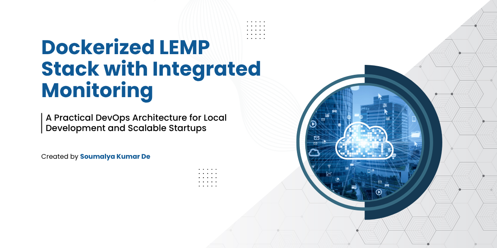
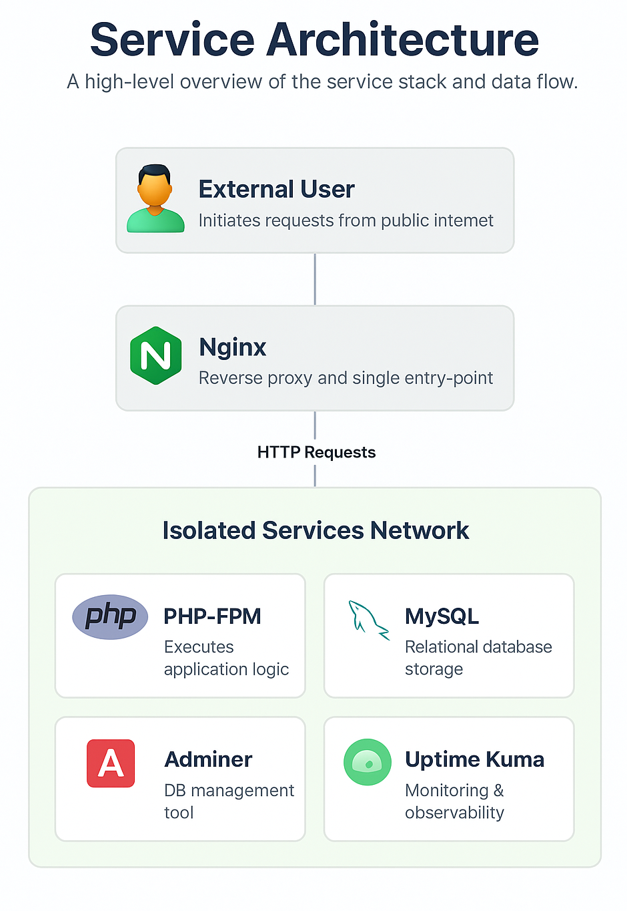
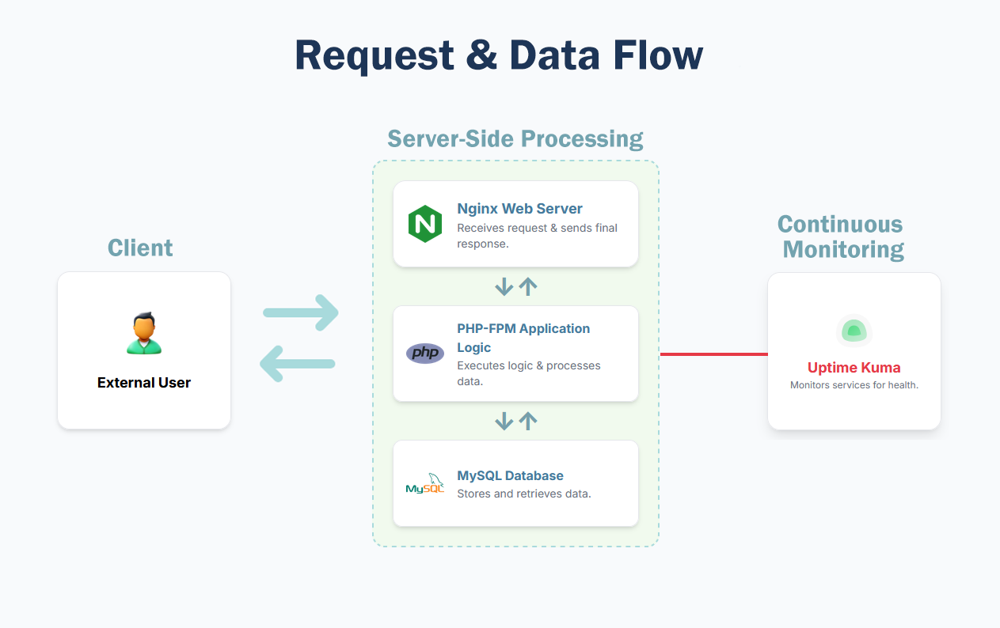

# Architecture

## Table of Contents

- [System Overview](#system-overview)
- [Components](#components)
- [System Architecture](#system-architecture)
- [Request and Data Flow](#request-and-data-flow)
- [Network Architecture](#network-architecture)
- [Data Persistence](#data-persistence)
- [Service Dependencies](#service-dependencies)
- [Configuration Management](#configuration-management)
- [Security Design](#security-design)
- [Scalability Considerations](#scalability-considerations)
- [Technology Stack](#technology-stack)
- [Design Principles](#design-principles)
- [Related Documentation](#related-documentation)

## System Overview

This LEMP stack implements a production-aligned architecture with integrated monitoring and security scanning.

<p align="center">
  
</p>

## Components

### Core Services

- **Nginx** (Alpine-based): Reverse proxy and web server
- **PHP-FPM 8.2**: Application runtime with extensions
- **MySQL 8**: Relational database with persistent volumes
- **Adminer**: Database management UI (dev profile only)
- **Uptime Kuma**: Monitoring and alerting dashboard

### Supporting Infrastructure

- **Docker Compose**: Service orchestration
- **Docker Networks**: Isolated internal communication
- **Named Volumes**: Persistent data storage
- **Health Checks**: Automated service health monitoring

## System Architecture

<p align="center">
  
</p>

The diagram above shows the complete system architecture including service dependencies, network isolation, and monitoring overlay.

## Request and Data Flow

This diagram illustrates how a request travels across Nginx → PHP-FPM → MySQL and how Uptime Kuma observes each hop.

<p align="center">
  
</p>

### Lifecycle (Happy Path)

- Client sends HTTP request → Nginx accepts on port 80 (host: 8080)
- Nginx forwards PHP requests to PHP-FPM over FastCGI (internal port 9000)
- PHP application reads environment variables (`DB_HOST`, `DB_NAME`, `DB_USER`, `DB_PASSWORD`)
- Application performs SQL via PDO/MySQL to the database (internal port 3306)
- Results are rendered by PHP and returned through Nginx to the client

### Monitoring Overlay

Uptime Kuma probes:
- **HTTP**: Nginx (port 8080) for application health
- **TCP**: PHP-FPM (port 9000) to ensure process is listening
- **TCP**: MySQL (port 3306) to verify database availability

If any monitor goes down, Kuma sends alerts (Telegram, Discord, etc.) and logs downtime.

## Network Architecture

### Internal Network (`lemp_network`)

All services communicate via a dedicated Docker bridge network:

```
lemp_network (bridge)
├── nginx:80 (internal)
├── php:9000 (internal, not exposed)
├── mysql:3306 (internal, not exposed)
├── adminer:8080 (internal)
└── uptime-kuma:3001 (internal)
```

### Port Mapping

| Service | Internal Port | Host Port | Public |
|---------|--------------|-----------|--------|
| Nginx | 80 | 8080 | ✅ |
| PHP-FPM | 9000 | - | ❌ |
| MySQL | 3306 | - | ❌ |
| Adminer | 8080 | 8081 | ✅ (dev only) |
| Uptime Kuma | 3001 | 3001 | ✅ |

**Security Note**: PHP-FPM and MySQL are NOT exposed to the host, preventing direct external access.

## Data Persistence

### Named Volumes

- `mysql_data`: MySQL database files (`/var/lib/mysql`)
- `kuma_data`: Uptime Kuma configuration and monitoring history (`/app/data`)

**Lifecycle**: Volumes persist across container restarts. Use `docker compose down --volumes` to remove.

## Service Dependencies

Services start in order based on health checks:

```
mysql (healthy) 
  ↓
php (depends_on: mysql, healthy)
  ↓  
nginx (depends_on: php, healthy)
  ↓
adminer (optional, --profile dev)
  ↓
uptime-kuma (independent, starts in parallel)
```

**Startup Time**: 30-60 seconds for all services to become healthy.

## Configuration Management

### Environment Variables

All secrets and configuration are externalized via `.env`:

- Database credentials (`DB_*`, `MYSQL_*`)
- Application environment (`APP_ENV`)
- Monitoring tokens (optional: `TELEGRAM_BOT_TOKEN`, `TELEGRAM_CHAT_ID`)
- Base image overrides (`NGINX_BASE_IMAGE`, `PHP_BASE_IMAGE`)

See [Configuration Guide](configuration.md) for complete reference.

### Build-Time Configuration

- `nginx/Dockerfile`: Custom image with curl for health checks
- `php/Dockerfile`: PHP-FPM with extensions (mysqli, pdo_mysql, opcache, bcmath)
- `php/php.ini`: Runtime settings (memory, execution time, OPcache)
- `nginx/default.conf`: Virtual host and FastCGI proxy configuration
- `mysql/init.sql`: Database schema and seed data

## Security Design

### Defense in Depth

1. **Network Isolation**: Internal services not exposed to host
2. **Secrets Management**: No credentials in code, only `.env` (gitignored)
3. **Dev-Only Diagnostics**: `info.php`, `test-db.php`, Adminer gated by `APP_ENV=development`
4. **Pre-Commit Hooks**: `gitleaks` and `detect-secrets` scan before push
5. **CI/CD Security**: Automated secret scanning, vulnerability scans (Trivy), SBOM generation

See [Security Guide](security.md) for comprehensive security practices.

## Scalability Considerations

### Current Limitations (Local/Staging Design)

- Single-instance services (no replication)
- Local volumes (not distributed)
- SQLite for Uptime Kuma (single node)
- No load balancing or horizontal scaling

### Production Adaptations

For production deployment, consider:

- **MySQL**: Managed service (AWS RDS, GCP Cloud SQL) or primary-replica setup
- **PHP-FPM**: Multiple replicas behind Nginx load balancer
- **Nginx**: Use as reverse proxy to upstream PHP-FPM pool
- **Secrets**: Kubernetes Secrets, AWS Secrets Manager, or HashiCorp Vault
- **Monitoring**: Prometheus + Grafana for metrics, centralized logging (Loki, ELK)
- **Storage**: Cloud object storage (S3) for assets, managed databases for persistence

## Technology Stack

| Layer | Technology | Version |
|-------|-----------|---------|
| **Web Server** | Nginx | alpine (latest) |
| **Runtime** | PHP-FPM | 8.2-fpm-alpine |
| **Database** | MySQL | 8.0 |
| **Container** | Docker | Engine 24+ |
| **Orchestration** | Docker Compose | v2 |
| **Monitoring** | Uptime Kuma | 1.x |
| **DB Admin** | Adminer | 4.x |

## Design Principles

1. **Ephemeral Containers**: Containers can be destroyed and recreated without data loss (volumes persist)
2. **Configuration as Code**: All settings in version control (except `.env`)
3. **Health-First Startup**: Services wait for dependencies to be healthy before starting
4. **Observability Built-In**: Monitoring is first-class, not an afterthought
5. **Development/Production Parity**: Same images and configuration, different env vars

## Related Documentation

- [Quickstart Guide](quickstart.md) - Get started in 5 minutes
- [Configuration Reference](configuration.md) - All environment variables
- [Monitoring Setup](monitoring.md) - Uptime Kuma and alerting
- [Security Practices](security.md) - Security hardening and best practices
- [Troubleshooting](troubleshooting.md) - Common issues and solutions
