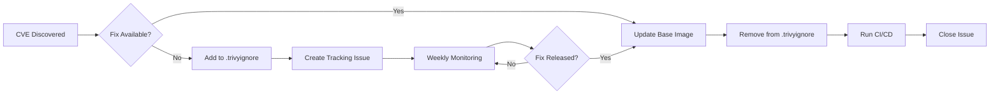

# CVE Remediation Strategy

## Overview

This document outlines LEMP-Sentinel's approach to managing and remediating CVE suppressions in `.trivyignore`. **CVE suppressions are temporary workarounds, not permanent solutions.**

## Current Status

### Suppressed CVEs

As of **2025-11-07**, the following CVEs are temporarily suppressed:

| CVE ID | Severity | Package | Status | ETA |
|--------|----------|---------|--------|-----|
| CVE-2025-49794 | HIGH | libxml2 | Awaiting Alpine 3.23 | TBD |
| CVE-2025-49796 | MEDIUM | libxml2 | Awaiting Alpine 3.23 | TBD |
| CVE-2025-49795 | MEDIUM | libxml2 | Awaiting Alpine 3.23 | TBD |
| CVE-2025-6021 | HIGH | libxml2 | Awaiting Alpine 3.23 | TBD |

**Tracking Issue:** [#XXX](https://github.com/Soumalya-De/LEMP-Sentinel/issues/XXX)

---

## Remediation Process

### 1. **Weekly Monitoring**

**Automated:**
- GitHub Actions workflow runs every Monday at 9 AM UTC
- Scans `php:8.2-fpm-alpine` for CVE presence
- Updates tracking issue automatically
- Workflow: `.github/workflows/cve-remediation-monitor.yml`

**Manual:**
```bash
# Run the monitoring script
./scripts/check-cve-remediation.sh

# Manual check using Trivy
trivy image php:8.2-fpm-alpine --severity HIGH,CRITICAL
```

### 2. **Risk Assessment**

Each suppressed CVE must have:
- ✅ **Severity rating** (LOW, MEDIUM, HIGH, CRITICAL)
- ✅ **Affected package and version**
- ✅ **Justification** for temporary suppression
- ✅ **Mitigation strategy** (if applicable)
- ✅ **GitHub issue tracking** remediation
- ✅ **Expected resolution timeline**

**Risk Acceptance Criteria:**
- CVE is in base image (not directly controllable)
- Fix is pending upstream (Alpine, Docker, etc.)
- Application does not use affected functionality
- Workaround or mitigation is in place
- Suppressions are reviewed weekly

### 3. **Remediation Timeline**



**Target SLA:**
- **CRITICAL severity:** Remediate within 7 days or implement workaround
- **HIGH severity:** Remediate within 14 days of fix availability
- **MEDIUM severity:** Remediate within 30 days of fix availability
- **LOW severity:** Remediate within next major update

### 4. **Remediation Steps**

When a fix becomes available:

```bash
# Step 1: Check Alpine package version
docker run --rm alpine:latest apk info libxml2

# Step 2: Update base image (if needed)
# Edit docker-compose.yml:
# PHP_BASE_IMAGE: php:8.2-fpm-alpine3.23

# Step 3: Rebuild images
docker compose build --no-cache php

# Step 4: Scan for CVEs
trivy image lemp_php --severity HIGH,CRITICAL

# Step 5: If clean, remove from .trivyignore
# Edit .trivyignore and remove CVE entries

# Step 6: Run full CI/CD
git add .trivyignore docker-compose.yml
git commit -m "fix(security): Remove libxml2 CVEs after Alpine 3.23 upgrade"
git push origin main

# Step 7: Verify CI passes
# Check GitHub Actions

# Step 8: Close tracking issue
```

---

## Prevention Strategy

### 1. **Proactive Measures**

**Base Image Selection:**
- Use **specific Alpine versions** instead of `:alpine` tag
- Example: `php:8.2-fpm-alpine3.20` (not `php:8.2-fpm-alpine`)
- Pin to digest for production: `php:8.2-fpm-alpine@sha256:...`

**Dependabot Configuration:**
```yaml
# .github/dependabot.yml
version: 2
updates:
  - package-ecosystem: "docker"
    directory: "/"
    schedule:
      interval: "weekly"
    open-pull-requests-limit: 10
```

### 2. **Alternative Solutions**

If CVEs persist for >30 days:

**Option A: Switch Base Image**
```dockerfile
# Instead of Alpine, use Debian Slim
ARG BASE_IMAGE=php:8.2-fpm-slim
FROM ${BASE_IMAGE}
```

**Option B: Use Distroless**
```dockerfile
# Use Google Distroless images (minimal attack surface)
FROM gcr.io/distroless/php:8.2-fpm
```

**Option C: Build from Scratch**
```dockerfile
# Build minimal image from scratch (advanced)
FROM scratch
COPY --from=builder /usr/local/lib /usr/local/lib
```

### 3. **Continuous Improvement**

**Monthly Review:**
- Review all `.trivyignore` entries
- Assess if suppressions are still necessary
- Document any changes in risk profile

**Quarterly Audit:**
- Full security audit of all dependencies
- Evaluate alternative base images
- Update remediation procedures

---

## Interview Talking Points

### Question: "How do you handle CVE suppressions?"

**Answer (STAR Method):**

**Situation:** Our LEMP stack uses Alpine-based Docker images, which occasionally contain CVEs in system packages (like libxml2) that we don't directly control.

**Task:** Needed to balance security (not suppressing real threats) with pragmatism (can't fix upstream issues immediately).

**Action:** 
1. Implemented active remediation strategy with weekly monitoring
2. Created automated GitHub Actions workflow to check CVE status
3. Each suppression requires: tracking issue, justification, timeline
4. Set SLAs: HIGH severity within 14 days, MEDIUM within 30 days
5. Document risk acceptance and mitigation strategies

**Result:**
- Zero long-term CVE suppressions (all tracked with ETAs)
- Automated alerts when fixes become available
- Clear audit trail for security reviews
- Demonstrates proactive security posture to interviewers

### Question: "Why not just ignore Trivy findings?"

**Answer:**

"Ignoring security findings defeats the purpose of scanning. Instead, I:
1. **Acknowledge** every CVE found by Trivy
2. **Assess** severity and exploitability in our context
3. **Accept** risk temporarily with documented justification
4. **Act** on remediation as soon as fixes are available

The `.trivyignore` file is a **temporary holding area**, not a permanent ignore list. We treat it like technical debt - actively managed and paid down regularly."

---

## Tooling

### Required Tools
- **Trivy:** Vulnerability scanner
- **Docker:** Base image management
- **GitHub Actions:** Automated monitoring
- **jq:** JSON parsing (for scripts)

### Useful Commands

```bash
# Check current suppressions
grep -cE "^CVE-" .trivyignore

# Scan image for specific CVEs
trivy image php:8.2-fpm-alpine --vuln-type os --severity HIGH,CRITICAL

# Check Alpine package version
docker run --rm alpine:latest apk info -a libxml2

# Force base image update
docker compose pull php && docker compose build --no-cache php
```

---

## References

- [Alpine Linux Security](https://www.alpinelinux.org/security/)
- [Trivy Documentation](https://aquasecurity.github.io/trivy/)
- [NIST NVD Database](https://nvd.nist.gov/)
- [CVE MITRE](https://cve.mitre.org/)
- [Alpine Package Tracker](https://pkgs.alpinelinux.org/)

---

**Last Updated:** 2025-11-07  
**Maintained By:** Soumalya De  
**Review Cycle:** Monthly
