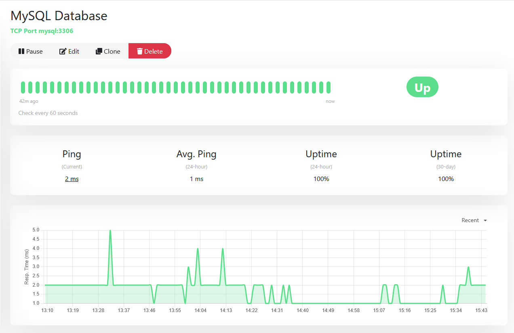
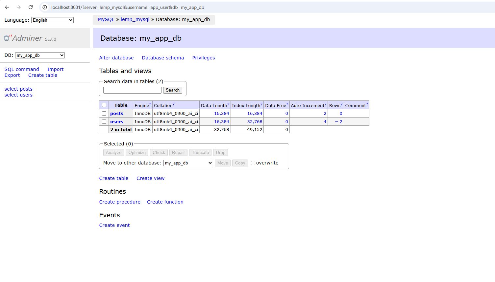
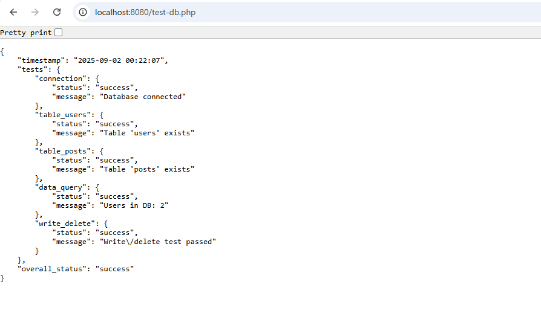

# Quickstart Guide

Get LEMP-Sentinel running locally in about 5 minutes.

## Table of Contents

- [Prerequisites](#prerequisites)
- [Quick Start (5 commands)](#quick-start-5-commands)
- [Access Points](#access-points)
  - [Uptime Kuma Monitoring Setup](#uptime-kuma-monitoring-setup)
  - [Adminer Login](#adminer-login)
- [Makefile Commands](#makefile-commands)
- [Verification Steps](#verification-steps)
- [Configuration](#configuration)
- [First-Time Setup](#first-time-setup)
- [Common Issues](#common-issues)
- [Next Steps](#next-steps)
- [Development Workflow](#development-workflow)
- [Production Checklist](#production-checklist)
- [Support](#support)

## Prerequisites

- Docker Engine 24+ and Docker Compose v2
- Git
- 2GB free RAM, 5GB disk space

### Platform-Specific Setup

#### Linux

```bash
# Ubuntu/Debian
sudo apt update && sudo apt install -y docker.io docker-compose-plugin git make
sudo usermod -aG docker $USER
newgrp docker

# RHEL/CentOS/Fedora
sudo dnf install -y docker docker-compose git make
sudo systemctl start docker
sudo usermod -aG docker $USER
newgrp docker
```

#### macOS

```bash
# Install Docker Desktop from https://docker.com/products/docker-desktop
# Or with Homebrew:
brew install --cask docker
brew install git make

# Start Docker Desktop from Applications
```

#### Windows

```powershell
# Install Docker Desktop from https://docker.com/products/docker-desktop
# Install Git from https://git-scm.com/download/win
# Install Make via Chocolatey:
choco install make

# Restart terminal after installation
```

**Windows Users**: Use PowerShell or Git Bash. If using WSL2, follow Linux instructions inside WSL.

## Quick Start (5 commands)

```bash
# 1. Clone repository
git clone https://github.com/Soumalya-De/LEMP-Sentinel.git
cd LEMP-Sentinel

# 2. Configure environment
cp .env.example .env

# 3. Start stack
docker compose up -d

# 4. Verify services
docker compose ps

# 5. Test application
curl http://localhost:8080
```

**Expected**: PHP welcome page with system information.

## Access Points

| Service | URL | Purpose |
|---------|-----|---------|
| **Application** | http://localhost:8080 | Main PHP application |
| **Database Test** | http://localhost:8080/test-db.php | Verify MySQL connection |
| **PHP Info** | http://localhost:8080/info.php | PHP diagnostics (dev only) |
| **Uptime Kuma** | http://localhost:3001 | Monitoring dashboard |
| **Adminer** | http://localhost:8081 | Database UI (dev only) |

### Uptime Kuma Monitoring Setup

Access http://localhost:3001 to configure monitoring for your services:

<p align="center">
  
</p>

*Screenshot: Configuring HTTP monitor for Nginx web server*

<p align="center">
  
</p>

*Screenshot: Configuring TCP monitor for MySQL database*

<p align="center">
  
</p>

*Screenshot: Setting up Telegram notifications for downtime alerts*

### Adminer Login

- **System**: MySQL
- **Server**: `mysql` (Docker service name)
- **Username**: `lemp_user` (from `.env`)
- **Password**: `lemp_password` (from `.env`)
- **Database**: `lemp_db` (from `.env`)

<p align="center">
  
</p>

*Screenshot: Adminer interface showing database tables and structure*

## Makefile Commands

The project includes a Makefile for common tasks:

```bash
# Start all services
make up

# Start with dev profile (includes Adminer)
make up-dev

# Stop all services
make down

# View logs (follow mode)
make logs

# View logs for specific service
make logs SERVICE=nginx

# Restart all services
make restart

# Check service status
make ps

# Run database backup
make backup

# Restore from backup
make restore BACKUP_FILE=backups/backup-20240115-143022.sql

# Generate bcrypt password hash
make bcrypt PASSWORD=mysecret

# Clean up (remove containers and volumes)
make clean
```

## Verification Steps

### 1. Check Service Health

```bash
docker compose ps
```

All services should show `Up (healthy)` status.

### 2. Test Application

```bash
# Test PHP
curl http://localhost:8080

# Test database connection
curl http://localhost:8080/test-db.php
```

**Expected**: Both return HTTP 200 with HTML content.

<p align="center">
  
</p>

*Screenshot: Dashboard showing successful database connection with user and post counts*

### 3. Check Logs

```bash
# All services
docker compose logs -f

# Specific service
docker compose logs -f nginx
```

No critical errors should appear (warnings about dev-only files are normal).

### 4. Test Database Connection

```bash
curl -s http://localhost:8080/test-db.php | jq
```

<p align="center">
  
</p>

*Screenshot: JSON output showing successful database tests (connection, tables, queries)*

## Configuration

### Environment Variables (.env)

Create `.env` from template:

```bash
cp .env.example .env
```

Key variables:

```bash
# Database credentials
MYSQL_ROOT_PASSWORD=rootpass
MYSQL_DATABASE=lemp_db
MYSQL_USER=lemp_user
MYSQL_PASSWORD=lemp_password

# Application environment
APP_ENV=development  # or production

# Monitoring (optional)
TELEGRAM_BOT_TOKEN=your_bot_token
TELEGRAM_CHAT_ID=your_chat_id
```

See [Configuration Reference](configuration.md) for more details.

### Production vs Development

**Development** (default):
```bash
APP_ENV=development
docker compose --profile dev up -d
```

Features enabled:
- `info.php` (phpinfo diagnostics)
- `test-db.php` (database connection test)
- Adminer (database UI on port 8081)

**Production**:
```bash
APP_ENV=production
docker compose up -d
```

Features disabled:
- Diagnostic endpoints return 404
- Adminer not started
- Error reporting minimized

## First-Time Setup

### 1. Monitoring Configuration

Visit http://localhost:3001 to configure Uptime Kuma:

1. Create admin account
2. Add monitors:
   - **HTTP**: `http://nginx` (application health)
   - **TCP**: `php:9000` (PHP-FPM)
   - **TCP**: `mysql:3306` (database)
3. Configure notifications (Telegram, Discord, email)

For Uptime Kuma configuration details, see [Configuration Reference](configuration.md).

### 2. Database Schema

Default schema is created automatically from `mysql/init.sql`:

```sql
CREATE TABLE IF NOT EXISTS users (
  id INT AUTO_INCREMENT PRIMARY KEY,
  username VARCHAR(50) NOT NULL UNIQUE,
  email VARCHAR(100) NOT NULL,
  password_hash VARCHAR(255) NOT NULL,
  created_at TIMESTAMP DEFAULT CURRENT_TIMESTAMP
);
```

Add your own tables by editing `mysql/init.sql` before first startup.

### 3. Application Files

Place PHP files in `www/` directory:

```
www/
├── index.php          # Homepage
├── info.php           # PHP diagnostics (dev only)
├── test-db.php        # Database test (dev only)
└── your-app/          # Your application code
```

Files are automatically available at `http://localhost:8080/`.

## Common Issues

### Port Conflicts

If ports 8080, 8081, or 3001 are in use:

```bash
# Find process using port
sudo lsof -i :8080

# Kill process or change port in docker-compose.yml
```

### Permission Errors (Linux)

```bash
# Add user to docker group
sudo usermod -aG docker $USER
newgrp docker

# Fix volume permissions
sudo chown -R $USER:$USER .
```

### Services Not Healthy

```bash
# Check logs for specific service
docker compose logs nginx

# Restart unhealthy service
docker compose restart nginx
```

For more common issues and solutions, see the [README Troubleshooting](../README.md#troubleshooting) section.

## Next Steps

- **[Architecture](architecture.md)**: Understand system design
- **[Configuration](configuration.md)**: Customize environment variables and production deployment
- **[Security Hardening](security-hardening.md)**: Harden production deployment
- **[CVE Remediation](cve-remediation.md)**: Vulnerability management strategy
- **[Secrets Management](secrets.md)**: Handle credentials securely
- **[CI/CD Workflows](ci-cd-workflows.md)**: Automated testing and scanning

## Development Workflow

```bash
# 1. Start stack with dev profile
make up-dev

# 2. Edit PHP files in www/
vim www/index.php

# 3. Changes are live (no rebuild needed)
curl http://localhost:8080

# 4. Check logs
make logs SERVICE=nginx

# 5. Stop when done
make down
```

**Hot Reload**: PHP files are mounted as volumes - changes reflect immediately without container restart.

## Production Checklist

Before deploying to production:

- [ ] Set `APP_ENV=production` in `.env`
- [ ] Use strong passwords for `MYSQL_ROOT_PASSWORD` and `MYSQL_PASSWORD`
- [ ] Remove or secure `info.php` and `test-db.php`
- [ ] Configure firewall rules (block direct MySQL access)
- [ ] Enable HTTPS with reverse proxy (nginx-proxy, Traefik, Caddy)
- [ ] Set up automated backups (`make backup` in cron)
- [ ] Configure Uptime Kuma alerts
- [ ] Review [Security Hardening](security-hardening.md)

## Support

- **Issues**: https://github.com/Soumalya-De/LEMP-Sentinel/issues
- **Security**: See [SECURITY.md](../SECURITY.md)
- **Contributing**: See [CONTRIBUTING.md](../CONTRIBUTING.md)
